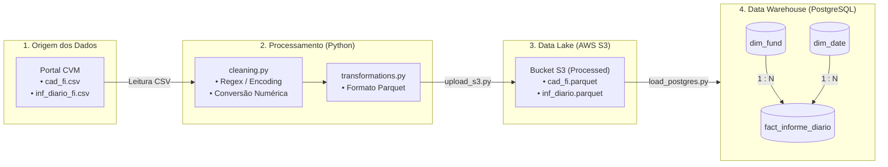

## Arquitetura da Solução

---

## Features / Funcionalidades

* **Pipeline ETL Resiliente:** Tratamento avançado de encoding (`ISO-8859-1`), remoção de espaços invisíveis e caracteres ocultos com expressões regulares (`Regex`).
* **Ingestão Otimizada com Parquet:** Conversão colunar reduzindo o tempo de I/O e os custos de armazenamento no AWS S3.
* **Modelagem Dimensional (Star Schema):** Estrutura no PostgreSQL com tabelas de dimensão (`dim_fund`, `dim_date`) e fato (`fact_informe_diario`) com validação de integridade referencial.
* **Auditoria e Logs:** Registro estruturado de execução via módulo `logging` para monitoramento de volume e consistência de dados em cada etapa.
