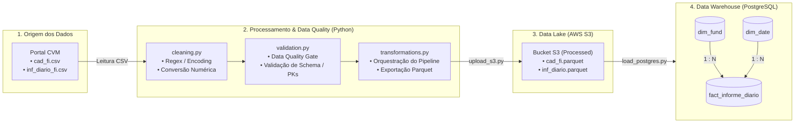

# CVM Business Analytics — Pipeline ETL, Data Quality & Data Warehouse

Pipeline end-to-end de Engenharia de Dados desenvolvida para ingestão, higienização, validação estrita de esquemas e modelagem dimensional do mercado de Fundos de Investimento no Brasil, utilizando dados abertos oficiais da CVM (Comissão de Valores Mobiliários).

---

## Arquitetura da Solução



---

## Estrutura do Repositório

```text
cvm-business/
├── data/
│   ├── raw/cvm/                           # Arquivos CSV brutos baixados da CVM (ignorado no git)
│   └── processed/cvm/                     # Arquivos Parquet higienizados e validados
├── sql/
│   ├── analytics/
│   │   └── advanced_financial_metrics.sql # Queries analiticas e metricas financeiras avancadas
│   ├── schema/
│   │   ├── dimensions.sql                 # DDL de criacao das dimensoes (dim_fund, dim_date)
│   │   └── fact_informe.sql               # DDL de criacao da tabela fato (fact_informe_diario)
│   └── validations/
│       └── audit_validations.sql          # Queries de auditoria e testes de Data Quality
├── src/
│   ├── aws/
│   │   └── upload_s3.py                   # Script de upload dos Parquets para o Bucket AWS S3
│   ├── ingestion/                         # Scripts de download e extracao dos dados brutos da CVM
        ├── cvm_client.py 
        └── download_data.py
│   └── processing/
│       ├── cleaning.py                    # Regras de higienizacao, parsing e Regex
│       ├── validation.py                  # Data Quality Gate (testes de schema, PKs e limites)
│       ├── transformations.py             # Orquestracao do pipeline local
│       └── load_postgres.py               # Carga dos dados do S3 para o PostgreSQL
├── .gitignore                             # Exclusao de arquivos pesados, .env e ambientes virtuais
├── requirements.txt                       # Dependencias do projeto
└── README.md                              # Documentacao do projeto
```

---

## Destaques Técnicos & Regras de Engenharia

* **Higienização Avançada de Arquivos Brutos:** Tratamento de encoding (`ISO-8859-1`), remoção de BOM (`\ufeff`), saneamento de caracteres ocultos (`\r`, `\xa0`) via expressões regulares (`Regex`) e formatação rigorosa de CNPJ para 14 dígitos (`zfill(14)`).
* **Tratamento de Negócio (Estoque vs. Fluxo):**
  * **Métricas de Estoque/Preço (`VL_PATRIM_LIQ`, `VL_QUOTA`, `VL_TOTAL`):** Exigem valores estritamente positivos (`> 0`). Registros nulos ou zerados são descartados para evitar distorções de patrimônio.
  * **Métricas de Fluxo (`CAPTC_DIA`, `RESG_DIA`):** Preenchidas com `0.0` caso não haja movimentação no dia, prevenindo a eliminação de dias operacionais normais.
* **Data Quality Gate (`validation.py`):**
  * Verificação automatizada de tipos de dados (*Schema Contract*).
  * Validação de chave primária composta (`CNPJ_FUNDO` + `DT_COMPTC`) na tabela fato.
  * Checagem de integridade sem tolerância a valores negativos em fluxos financeiros.
* **Armazenamento Otimizado em Nuvem (AWS S3):** Persistência intermediária em formato colunar **Apache Parquet**, otimizando consumo de rede, I/O e custos de armazenamento.
* **Resolução de Integridade Referencial:** Manutenção do histórico completo de **41.104 fundos únicos** na dimensão, garantindo **0 registros órfãos** e permitindo a contabilização auditada de **119.586 linhas na fato** (> R$ 280 bilhões movimentados).

---

## Modelagem Dimensional (Star Schema)

* **`dim_fund` (Dimensão):** `CNPJ_FUNDO` (PK), `DENOM_SOCIAL`, `CLASSE`, `TP_FUNDO`, `PUBLICO_ALVO`, `ADMIN`, `GESTOR`, `SG_UF`, `MUNICIPIO`.
* **`dim_date` (Dimensão):** `DT_COMPTC` (PK), `ANO`, `MES`, `DIA`, `TRIMESTRE`, `SEMESTRE`, `DIA_SEMANA`.
* **`fact_informe_diario` (Fato):** `CNPJ_FUNDO` (FK), `DT_COMPTC` (FK), `VL_TOTAL`, `VL_QUOTA`, `VL_PATRIM_LIQ`, `CAPTC_DIA`, `RESG_DIA`, `NR_COTST`, `CAPT_LIQUIDA_DIA`.

---

## Como Executar o Projeto

### 1. Clonar o repositório e preparar o ambiente
```bash
git clone https://github.com/lomaloma11/cvm-business.git
cd cvm-business

python -m venv cvm-venv
source cvm-venv/bin/activate  # No Windows: cvm-venv\Scripts\activate
pip install -r requirements.txt
```

### 2. Configurar variáveis de ambiente (`.env`)
Crie um arquivo `.env` na raiz do projeto com as seguintes credenciais:
```env
AWS_ACCESS_KEY_ID=sua_access_key
AWS_SECRET_ACCESS_KEY=sua_secret_key
AWS_REGION=us-east-1
S3_BUCKET_NAME=cvm-business-datalake

DB_HOST=localhost
DB_PORT=5432
DB_NAME=cvm_dw
DB_USER=seu_usuario
DB_PASSWORD=sua_senha
```

### 3. Executar o Pipeline
```bash

# 0. Rodar o script de download dos dados para fazer as etapas principais
python src/ingestion/download_data.py

# 1. Processa, limpa e valida os dados brutos (gera Parquets locais)
python src/processing/transformations.py

# 2. Faz o upload dos arquivos processados para o AWS S3
python src/aws/upload_s3.py

# 3. Carrega os dados do S3 diretamente no Data Warehouse PostgreSQL
python src/processing/load_postgres.py
```

---

## Auditoria e Qualidade de Dados (SQL)

Para verificar a consistência dos dados carregados no PostgreSQL, execute o script disponível em `sql/validations/audit_validations.sql`:

```sql
-- Checagem de integridade referencial (Resultado esperado: 0 órfãos)
SELECT COUNT(*) AS total_informes_orfaos
FROM fact_informe_diario f
LEFT JOIN dim_fund d ON f.cnpj_fundo = d.cnpj_fundo
WHERE d.cnpj_fundo IS NULL;

-- Checagem de limites de negócio (Resultado esperado: 0 inconsistências)
SELECT 
    COUNT(CASE WHEN vl_patrim_liq <= 0 THEN 1 END) AS pl_invalido,
    COUNT(CASE WHEN vl_quota <= 0 THEN 1 END) AS cota_invalida,
    COUNT(CASE WHEN captc_dia < 0 THEN 1 END) AS captacao_negativa,
    COUNT(CASE WHEN resg_dia < 0 THEN 1 END) AS resgate_negativo
FROM fact_informe_diario;
```

---

## Tecnologias Utilizadas

* **Linguagem & Processamento:** Python (Pandas, NumPy, Logging, Regex)
* **Data Quality & Validação:** Python Scripts (`validation.py`), SQL Assertions
* **Cloud Storage & Data Lake:** AWS S3, Apache Parquet
* **Data Warehouse & Banco de Dados:** PostgreSQL, Modelagem Star Schema
* **Versionamento & Governança:** Git, GitHub
